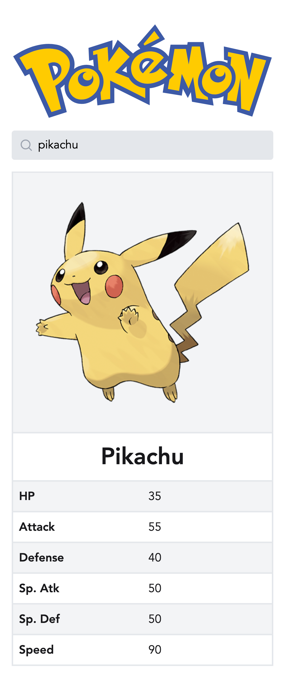

# Vue Pokedex

Your mission is to complete this Pokedex app, using Vue and your frontend knowledge. When you have reached the end of the test you should have something like this:

## Instructions

1. Implement the `getPokemon` and `getRandomPokemon` functions in `src/api/index.js` to consume the [PokeAPI](https://pokeapi.co). You can use [axios](https://github.com/axios/axios) or [fetch](https://developer.mozilla.org/en-US/docs/Web/API/fetch) to communicate with the API, whichever you prefer.

2. Finish the `PokemonCard` component by adding the official artwork sprite image and appropriate base stats to the table in the cells marked "INSERT STAT". You can refer to the PokeAPI [Pokemon endpoint documentation](https://pokeapi.co/docs/v2#pokemon) for the data structure, for example you can access the HP base stat like so `pokemon.stats[0].base_stat`.

3. When the app is first mounted, we want to show a random Pokemon using the `getRandomPokemon` function and the `PokemonCard` component. While fetching data, you should show a loading spinner using the `Loader` component.

4. Add the ability to search for a Pokemon by name or a National Pokedex number using the `SearchField` component and the `getPokemon` function. You should debounce the search to reduce the number of API requests while typing in the field by using the `debounce` function from `lodash-es`. **Note:** The API expects names to be lowercase, so you should transform the value before sending the request.

5. **Bonus:** Implement the steps above using the new Composition API instead of the Options API.
